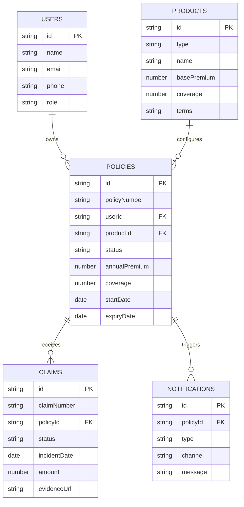

# Policy Management System

A Spring Boot insurance policy lifecycle prototype. It covers product comparison, premium calculation, policy purchase, certificate generation, renewal reminders, and a claims workflow with state transitions.

## Run

```bash
npm install
npm run build
mvn spring-boot:run
```

Open `http://localhost:3000`.

## Demo Flow

1. Open the public site and review Home, Products, About, Testimonials, and Contact pages.
2. Sign in with a role account.
3. As a policyholder, calculate premium, buy a policy, download the certificate, and file a claim.
4. As an underwriter/admin, review platform metrics and create new products.
5. As a claims adjuster, verify evidence and move claims through `Submitted -> Verified -> Approved -> Disbursed`, or reject them.

## Demo Accounts

| Role | Email | Password |
| --- | --- | --- |
| Policyholder | `aarav@example.com` | `user123` |
| Underwriter / Admin | `admin@example.com` | `admin123` |
| Claims Adjuster | `claims@example.com` | `claims123` |

## Architecture

- `src/main/java/com/trustbridge/policy`: Spring Boot backend.
- `repository/InMemoryPolicyRepository.java`: Seed data and demo persistence. Replace with Spring Data MongoDB repositories for production.
- `service/PremiumService.java`: Dynamic premium engine.
- `service/ClaimService.java`: State-machine style claim transitions.
- `service/RenewalScheduler.java`: Scheduled renewal reminder sweep.
- `service/PdfCertificateService.java`: Auto-generated PDF policy certificate.
- `src/frontend`: React frontend with routed pages and reusable components.
- `src/main/resources/static`: Built React assets served by Spring Boot.

## ER Diagram



## Notes

This prototype uses an in-memory repository and mock Cloudinary URLs to keep the demo quick to run. A production version would replace the repository with Spring Data MongoDB, add Spring Security role guards, use Cloudinary SDK upload services, and swap the lightweight PDF generator for iText7 or JasperReports.
